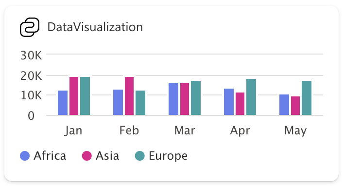
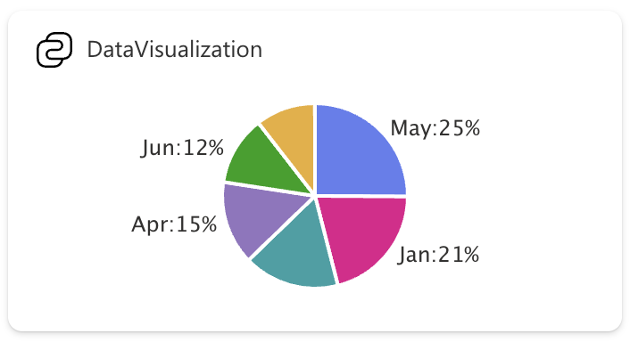

# Create a Data Visualization Adaptive Card Extension

The [SharePoint Framework v1.19](../../release-1.19.md) introduces a new Data Visualization Template that can be used to implement charts. This tutorial provides step-by-step guidance on implementing Data Visualization with Adaptive Card Extensions (ACEs).

> [!NOTE]
> Before you start, complete the procedures in the following articles to ensure that you understand the basic flow of creating a custom Adaptive Card Extension: [Build your first SharePoint Adaptive Card Extension](./build-first-sharepoint-adaptive-card-extension.md)

## Scaffold an Adaptive Card Extension project

Create a new project directory for your project and change your current folder to that directory.

Create a new project by running the Yeoman SharePoint Generator from within the new directory you created:

```console
yo @microsoft/sharepoint
```

When prompted, enter the following values (select the default option for all other prompts):

- **What is your solution name?** dataVisualization-tutorial
- **Which type of client-side component to create?** Adaptive Card Extension
- **Which template do you want to use?** Data Visualization Card Template
- **What is your Adaptive Card Extension name?** DataVisualization

At this point, Yeoman installs the required dependencies and scaffolds the solution files. This process might take few minutes.

Next, run **gulp serve** from the command line in the root of the project. Select the add icon in the hosted workbench to open the toolbox, you'll see the **Data Visualization** card:


Select the **DataVisualization** component to add it to the workbench. The default rendering renders the line chart using mock data:


## Explore the scaffolded code

### Explore the Card View

Locate and open the following file: **./src/adaptiveCardExtensions/dataVisualization/cardView/CardView.ts**. The card view implements the `BaseComponentsCardView` base class `cardViewParameters` getter to specify the card configuration:

```typescript
const seriesData : IDataPoint<Date>[] = [
  ... // omitted for brevity
];

export class CardView extends BaseComponentsCardView<..> {
  public get cardViewParameters(): IDataVisualizationCardViewParameters {
    return LineChartCardView({
      cardBar: {
        componentName: 'cardBar',
        title: this.properties.title
      },
      body: {
        componentName: 'dataVisualization',
        dataVisualizationKind: 'line',
        series: [{
          data: seriesData,
          lastDataPointLabel: '3.1K'
        }]
      }
    });
  }
}
```

Notice how the `body` section of the card view specifies the `dataVisualization` component.

### Explore possible layouts

Based on the configuration in card view, a chart can be rendered in two layouts:

#### Regular

Adding zero or one component along with a `dataVisualization` component in the body:


#### Right side

Adding more than one component in the card view along with `dataVisualization` component in the body will render the chart on the right side of the card. For example: Header and Footer along with `dataVisualization` component in body.

Locate & replace the `cardViewParameters()` getter with the following code to add a `header` and `footer` to the card:

```typescript
public get cardViewParameters(): IDataVisualizationCardViewParameters {
  return LineChartCardView({
    cardBar: {
      componentName: 'cardBar',
      title: this.properties.title
    },
    header: {
      componentName: 'text',
      text: 'Sales Projection'
    },
    body: {
      componentName: 'dataVisualization',
      dataVisualizationKind: 'line',
      series: [{
          data: seriesData,
          lastDataPointLabel: '3.1K'
      }]
    },
    footer: {
      componentName: 'cardButton',
      title: 'View Details',
      action: {
        type: 'QuickView',
        parameters: {
          view: QUICK_VIEW_REGISTRY_ID
        }
      }
    }
  });
}
```


### Explore the Quick Views

The ACE class is located in the following file: **./src/adaptiveCardExtensions/dataVisualization/quickView/QuickView.ts** and mostly has the same code as [Generic Card View](./build-first-sharepoint-adaptive-card-extension.md).

### Explore the ACE class

The ACE class is located in the following file: **./src/adaptiveCardExtensions/dataVisualization/dataVisualizationAdaptiveCardExtension.ts** and mostly has the same code as [Generic Card View](./build-first-sharepoint-adaptive-card-extension.md).

## Support for multiple data series in the chart

The ACE `dataVisualization` component supports multiple series lines in the chart. To add multiple lines to the chart, add additional entries to the `body.series` array on the `LineChartCardView` object in the card view.

For example, consider the following data series:

```typescript
// Sample Data
const seriesData : IDataPoint<Date>[] = [
  { x: new Date(2024, 1, 1), y: 1000 },
  { x: new Date(2024, 2, 1), y: 2400 },
  { x: new Date(2024, 3, 1), y: 2000 },
  { x: new Date(2024, 4, 1), y: 2900 },
  { x: new Date(2024, 5, 1), y: 3000 },
  { x: new Date(2024, 6, 1), y: 3100 }
];

const seriesData2 : IDataPoint<Date>[] = [
  { x: new Date(2024, 1, 1), y: 600 },
  { x: new Date(2024, 2, 1), y: 1200 },
  { x: new Date(2024, 3, 1), y: 3200 },
  { x: new Date(2024, 4, 1), y: 2800 },
  { x: new Date(2024, 5, 1), y: 3600 },
  { x: new Date(2024, 6, 1), y: 4500 }
];

const seriesData3 : IDataPoint<Date>[] = [
  { x: new Date(2024, 1, 1), y: 5200 },
  { x: new Date(2024, 2, 1), y: 1000 },
  { x: new Date(2024, 3, 1), y: 1800 },
  { x: new Date(2024, 4, 1), y: 2900 },
  { x: new Date(2024, 5, 1), y: 600 },
  { x: new Date(2024, 6, 1), y: 400 }
];
```

Add all three series to the data visualization card view and optionally set the color of specific series:

```typescript
export class CardView extends BaseComponentsCardView<
  IRecentSalesAdaptiveCardExtensionProps,
  IRecentSalesAdaptiveCardExtensionState,
  IDataVisualizationCardViewParameters
> {
  public get cardViewParameters(): IDataVisualizationCardViewParameters {
    return LineChartCardView({
      cardBar: {
        componentName: 'cardBar',
        title: this.properties.title
      },
      body: {
        componentName: 'dataVisualization',
        dataVisualizationKind: 'line',
        series: [{
          data: seriesData,
          lastDataPointLabel: '3.1K'
        },
        {
          data: seriesData2,
          lastDataPointLabel: '4.5K',
          color: '#800080'
        },
        {
          data: seriesData3,
          lastDataPointLabel: '0.4K',
          color: '#01CBAE'
        }]
      }
    });
  }

  public get onCardSelection(): IQuickViewCardAction | IExternalLinkCardAction | undefined {
    return {
      type: 'QuickView',
      parameters: { view: QUICK_VIEW_REGISTRY_ID }
    };
  }
}
```

This card when in the large mode will generate the following rendering:


## Support for additional chart types
The SharePoint Framework v1.20 introduces support for newer chart types, enabling developers to create visually appealing data visualizations like bar, pie and donut charts. This section provides an example of each of them.

### Bar Chart
To render a vertically grouped bar chart, follow this example:
```typescript
// Sample Data
const seriesData: IDataPoint<string>[] = [
  {
    x: "Jan",
    y: 12986
  },
  {
    x: "Feb",
    y: 13424
  },
  {
    x: "Mar",
    y: 17118
  },
  {
    x: "Apr",
    y: 14017
  },
  {
    x: "May",
    y: 11245
  }
];

const seriesData2: IDataPoint<string>[] = [
  {
    x: "Jan",
    y: 19631
  },
  {
    x: "Feb",
    y: 19905
  },
  {
    x: "Mar",
    y: 17098
  },
  {
    x: "Apr",
    y: 11918
  },
  {
    x: "May",
    y: 10357
  }
];

const seriesData3: IDataPoint<string>[] = [
  {
    x: "Jan",
    y: 19762
  },
  {
    x: "Feb",
    y: 12926
  },
  {
    x: "Mar",
    y: 17670
  },
  {
    x: "Apr",
    y: 19055
  },
  {
    x: "May",
    y: 18142
  }
];
```
Add all three series to the data visualization card view and optionally set the name or color of the individual series:
```typescript
export class CardView extends BaseComponentsCardView<
  IDataVisualizationAdaptiveCardExtensionProps,
  IDataVisualizationAdaptiveCardExtensionState,
  IDataVisualizationCardViewParameters
> {
  public get cardViewParameters(): IDataVisualizationCardViewParameters {
    return BarChartCardView({
      cardBar: {
        componentName: 'cardBar',
        title: this.properties.title
      },
      body: {
        componentName: 'dataVisualization',
        dataVisualizationKind: 'bar',
        series: [{
            data: seriesData,
            name: 'Africa'
        }, {
            data: seriesData2,
            name: 'Asia'
        }, {
            data: seriesData3,
            name: 'Europe'
        }]
      }
    });
  }
}
```
The rendered bar chart looks something like this:


### Pie/Donut Charts
Here is an example of the CardView.ts file that renders a Pie chart with the given data:
```typescript
import {
  BaseComponentsCardView,
  IDataVisualizationCardViewParameters,
  PieChartCardView,
  IPieDataPoint,
} from '@microsoft/sp-adaptive-card-extension-base';
import {
  IDataVisualizationAdaptiveCardExtensionProps,
  IDataVisualizationAdaptiveCardExtensionState,
} from '../DataVisualizationAdaptiveCardExtension';

// Sample Data
const seriesData: IPieDataPoint[] = [
  { x: 'January', y: 50 },
  { x: 'February', y: 25, color: '#eaae32', showLabel: false },
  { x: 'March', y: 40, showLabel: false },
  { x: 'Apr', y: 35 },
  { x: 'May', y: 60 },
  { x: 'Jun', y: 29 }
];

export class CardView extends BaseComponentsCardView<
  IDataVisualizationAdaptiveCardExtensionProps,
  IDataVisualizationAdaptiveCardExtensionState,
  IDataVisualizationCardViewParameters
> {
  public get cardViewParameters(): IDataVisualizationCardViewParameters {
    return PieChartCardView({
      cardBar: {
        componentName: 'cardBar',
        title: this.properties.title
      },
      body: {
        componentName: 'dataVisualization',
        dataVisualizationKind: 'pie',
        isDonut: false,
        series: [{
            data: seriesData,
        }]
      }
    });
  }
}
```
Notice how the `dataVisualizationKind` is set to `pie` and `PieChartCardView` is returned with the required parameters. Upon refreshing the card on the workbench, you will see that a pie chart is rendered:


The `isDonut` flag indicates if the pie chart should be rendered as a donut chart, which is `false` by default. When set to true, the donut chart is rendered as follows:


The numeric text in the center displays the sum of all the y values in the series.

## See Also

- Video: **[Introducing new Viva Connections chart card layout option](https://www.youtube.com/watch?v=JOIb4KhiWAI)**
- Sample: **[Chart Card - Page Creation](https://github.com/pnp/sp-dev-fx-aces/tree/main/samples/ChartCard-PageCreation)**
- Sample: **[Chart Card - Three Series](https://github.com/pnp/sp-dev-fx-aces/tree/main/samples/ChartCard-ThreeSeries)**
